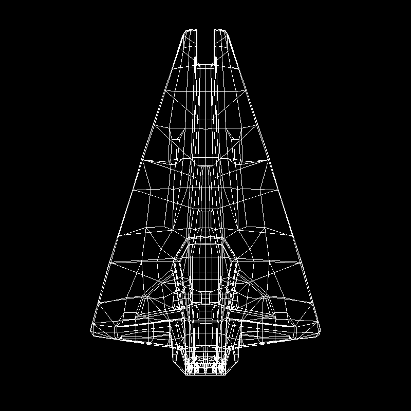
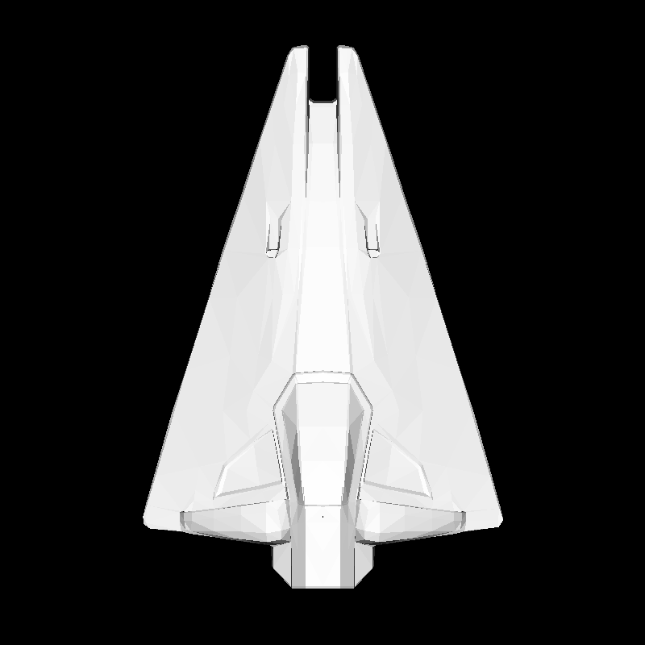
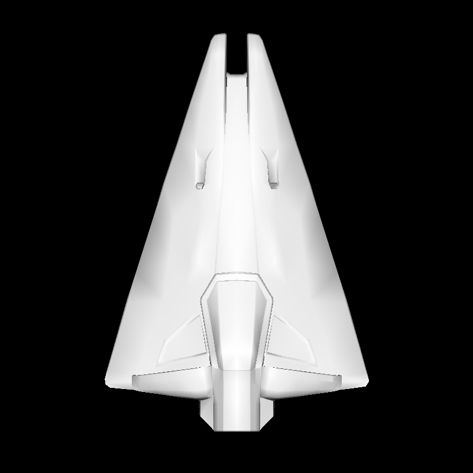
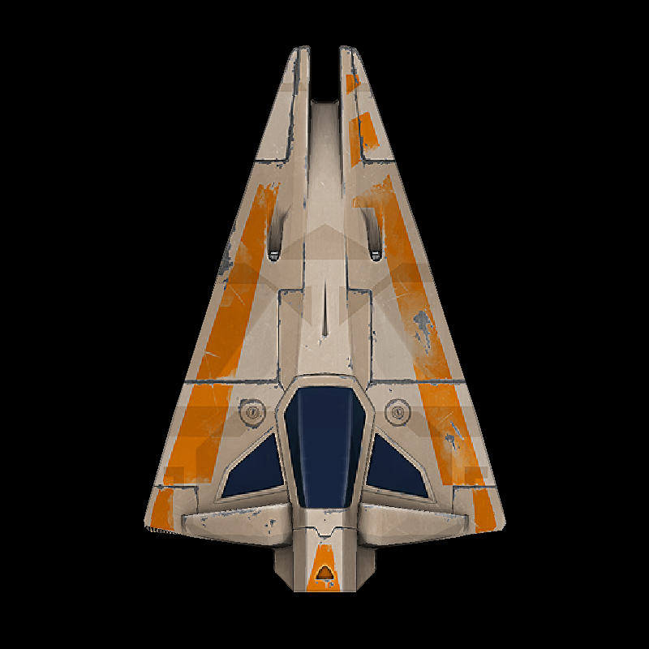
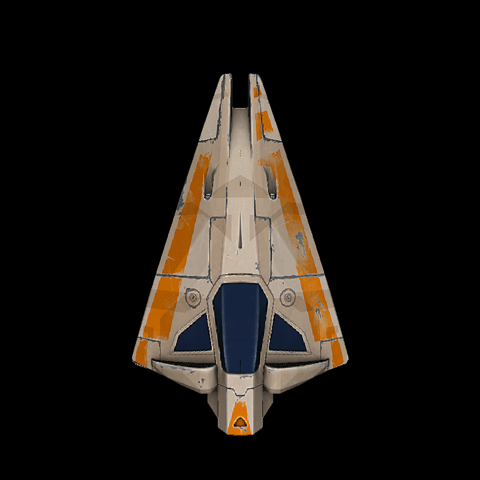

# tinyrenderer

OpenGL clone for image rendering, which writes its output to a PNG file. Based on [this tutorial](https://github.com/ssloy/tinyrenderer/wiki) found on [this list](https://github.com/danistefanovic/build-your-own-x).

## About PNG images

The referenced tutorial uses TGA images (see files `tgaimage.cpp` and `tgafile.h`) for the rendering results. This version uses PNG images for this purpose (see `pngimage`, which uses `pngchunk` and `rgbcolor` to work).

### `pngimage`: Basic PNG image library with load/save operations

This module allows for basic loading, modifying and writing operations with PNG images. It can load images with RGB data (no alpha channel, no palette) and it doesn't support compression as it wasn't the main goal of this project.

Examples and usage info can be found [on its folder](https://github.com/diegoroyo/tinyrenderer/tree/master/pngimage).

More info about the process of loading/saving an image and the needed calculations (filters, checksums, etc.) can be found on the source code.

## Rendered examples

Some example images generated by the renderer. More will be added as I keep working on it:

Wireframe | Flat shading | Gouraud shading
:---: | :---: | :---:
 |  | 

Texturing | Perspective projection
:---: | :---:
 | 