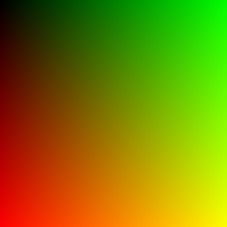

## `pngimage`: Basic PNG image library with load/save operations

### Basic operations

```C++
/* Load/save image */
bool read_png_file(const char* filename);
bool write_png_file(const char* filename);
/* Modify pixel data */
bool get_pixel(int x, int y, RGBColor& color);
void set_pixel(int x, int y, const RGBColor& color);
```

### Example code

```C++
/* Create an image from scratch (256x256px) */
PNGImage gradient(256, 256);
for (int y = 0; y < gradient.height; y++) {
    for (int x = 0; x < gradient.width; x++) {
        RGBColor color(y * 255 / gradient.height,  // r
                       x * 255 / gradient.width,   // g
                       0);                         // b
        gradient.set_pixel(x, y, color);
    }
}

/* Save contents in a new file */
gradient.write_png_file("gradient.png");

/* Read the file and create a modified copy */
PNGImage negative;
negative.read_png_file("gradient.png");
RGBColor color;
for (int y = 0; y < negative.height; y++) {
    for (int x = 0; x < negative.width; x++) {
        negative.get_pixel(x, y, color);
        color.r = 255 - color.r;
        color.g = 255 - color.g;
        color.b = 255 - color.b;
        negative.set_pixel(x, y, color);
    }
}

/* Save the copy */
negative.write_png_file("gradient_negative.png");
```

### Results

`gradient.png` | `gradient_negative.png`
:---: | :---:
 | 